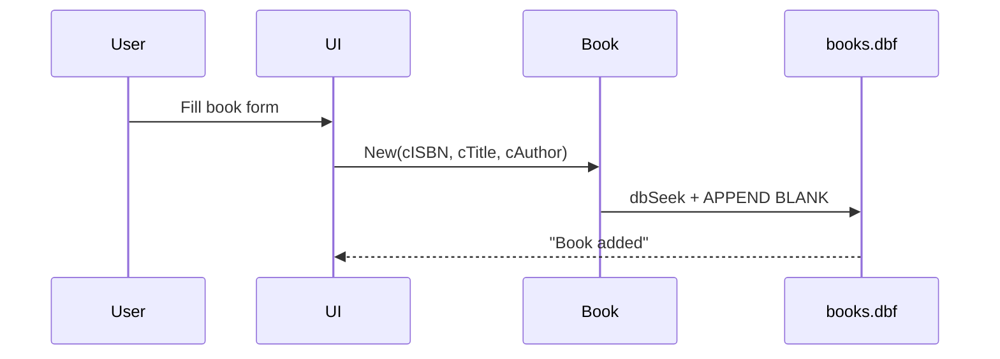

# Library Management System User Manual
**Version 0.1**  
*Harbour Programming Language User Manual*  
*Date: August 7, 2025*  
*© 2025 BadaSystem*  

---

## Table of Contents
- [Library Management System User Manual](#library-management-system-user-manual)
  - [Table of Contents](#table-of-contents)
  - [Introduction](#introduction)
  - [Installation Guide](#installation-guide)
    - [System Requirements](#system-requirements)
    - [Step-by-Step Setup](#step-by-step-setup)
    - [Troubleshooting](#troubleshooting)
  - [Code Documentation](#code-documentation)
    - [Book Class](#book-class)
    - [Loan Class](#loan-class)
    - [HbORM Class](#hborm-class)
  - [User Guide](#user-guide)
    - [Running the Application](#running-the-application)
    - [User Interface Instructions](#user-interface-instructions)
    - [Common Tasks](#common-tasks)
  - [Technical Reference](#technical-reference)
    - [Compiler Flags](#compiler-flags)
    - [API Details](#api-details)
  - [🔄 Data Flow Example: Adding a Book](#-data-flow-example-adding-a-book)
  - [FAQ \& Troubleshooting](#faq--troubleshooting)
  - [Appendices](#appendices)
    - [Glossary](#glossary)
    - [License Information](#license-information)

---

## Introduction

The **Library Management System** is a comprehensive application developed using the Harbour programming language, designed to manage library operations efficiently. It leverages the MiniGUI library for a graphical user interface and the DBFCDX Record Driver Database (RDD) for robust database management. The system supports book management, user and employee administration, loan processing, and report generation, making it an essential tool for library staff.

This manual is intended for:
- **Developers** extending or maintaining the system.
- **Librarians and Administrators** using the application to manage library resources.

**Key Features**:
- 📚 **Book Management**: Add, update, delete, and scan books using ISBN.
- 👤 **User Management**: Create and manage user accounts with role-based access.
- 📖 **Loan Management**: Process book checkouts and returns.
- 📊 **Reporting**: Generate reports on loans, overdue books, inventory, and user activity.
- 🔒 **Authentication**: Secure login with role-based access control (Admin, Librarian, User).

---

## Installation Guide

### System Requirements
To run the Library Management System, ensure the following:

- **Operating System**: Windows 10 or later (32-bit or 64-bit).
- **Harbour Version**: Harbour 3.2 or later.
- **Dependencies**:
  - MiniGUI (for GUI components).
  - DBFCDX RDD (for database operations).
  - Borland C++ Compiler (BCC) 5.5 or later (32-bit).
- **Disk Space**: Minimum 50 MB for application and database files.
- **RAM**: Minimum 512 MB (1 GB recommended).

### Step-by-Step Setup
1. **Install Harbour**:
   - Download Harbour from [https://harbour.github.io/](https://harbour.github.io/).
   - Add Harbour to the system PATH.
2. **Install MiniGUI**:
   - Obtain MiniGUI from [http://www.hmgextended.com/](http://www.hmgextended.com/) and follow installation instructions.
3. **Set Up Borland C++ Compiler**:
   - Install BCC 5.8 or later and configure it with Harbour.
4. **Compile the Application**:
   ```bash
   hbmk2 LibrarySystemMain.prg -lminigui -ldbfcdx
   ```
5. **Create Data Directory**:
   - Create a `data` directory in the application root to store DBF files.
6. **Run the Application**:
   ```bash
   ./LibrarySystemMain.exe
   ```

### Troubleshooting
- **Error: Missing MiniGUI library**  
  Ensure MiniGUI is installed and the `-lminigui` flag is used during compilation.
- **Error: DBFCDX not found**  
  Verify that DBFCDX is linked with `-ldbfcdx`.
- **Error: Database verification failed**  
  Check that the `data` directory exists and is writable.
- **Error: Application crashes on startup**  
  Confirm Harbour 3.2+ is installed and the PATH is set correctly.

---

## Code Documentation

### Book Class
**Description**: Manages book records, including adding, updating, deleting, and checking availability.

**Key Methods**:
- **New(cISBN, cTitle, cAuthor)**  
  *Description*: Initializes a book object with ISBN, title, and author.  
  *Parameters*:  
    - `cISBN` (string): Book ISBN.  
    - `cTitle` (string): Book title.  
    - `cAuthor` (string): Book author.  
  *Returns*: Object (self).  
  *Example*:
    ```harbour
    METHOD New(cISBN, cTitle, cAuthor) CLASS Book
        ::ISBN   := cISBN
        ::TITLE  := cTitle
        ::AUTHOR := cAuthor
        ::STATUS := "AVAILABLE"
        ::oBooks := HbORM():New("books", "books", "data\")
    RETURN Self
    ```
  *Notes*: The default status is "AVAILABLE". Ensure the `books.dbf` file exists in the `data` directory.

- **checkAvailability()**  
  *Description*: Checks if a book is available for checkout.  
  *Returns*: Logical (true if available, false otherwise).  
  *Example*:
    ```harbour
    METHOD checkAvailability() CLASS Book
        LOCAL lAvailable := .F.
        TRY
            ::oBooks:Open()
            IF ::oBooks:Seek(::ISBN)
                ::STATUS   := ::oBooks:GetValue("STATUS")
                lAvailable := ::oBooks:GetValue("STATUS") == "AVAILABLE"
            ENDIF
            ::oBooks:Close()
        CATCH oError
            MsgStop("Database verification failed: " + oError:description)
        END
    RETURN lAvailable
    ```
  *Notes*: Handles database errors with a message box. Ensure the ISBN exists in the database.

### Loan Class
**Description**: Manages loan transactions, including processing book returns.

**Key Methods**:
- **New(cLoanID, cUserID, cISBN, dCheckout, dDue, dReturn)**  
  *Description*: Initializes a loan object with loan details.  
  *Parameters*:  
    - `cLoanID` (string): Unique loan identifier.  
    - `cUserID` (string): User ID.  
    - `cISBN` (string): Book ISBN.  
    - `dCheckout`, `dDue`, `dReturn` (dates): Checkout, due, and return dates.  
  *Returns*: Object (self).

- **processReturn()**  
  *Description*: Processes a book return, updating the loan and book status.  
  *Returns*: Logical (true on success).  
  *Example*:
    ```harbour
    METHOD processReturn() CLASS Loan
        LOCAL lReturn
        TRY
            ::oLoans:Open()
            IF ::oLoans:Seek(::LOANID) .AND. Empty(::oLoans:GetValue("RETURNDATE"))
                ::oLoans:SetValue("RETURNDATE", Date())
                ::oBooks:Open()
                IF ::oBooks:Seek(::ISBN)
                    ::oBooks:SetValue("STATUS","AVAILABLE")
                ENDIF
                ::oBooks:Close()
                lReturn := .T.
            ELSE
                lReturn := .F.
            ENDIF
            ::oLoans:Close()
        CATCH
            MsgStop("Database verification failed class loans: " + oError:description)
        END
    RETURN lReturn
    ```
  *Notes*: The method sets the book status to "AVAILABLE" and updates the return date. Ensure the loan ID and ISBN are valid.

### HbORM Class
**Description**: A custom Object-Relational Mapping (ORM) library for managing DBF/CDX tables.

**Key Methods**:
- **New(cTable, cAlias, cPath)**  
  *Description*: Initializes the ORM with table details.  
  *Parameters*:  
    - `cTable` (string): Table name.  
    - `cAlias` (string): Table alias.  
    - `cPath` (string): Directory path for DBF files.  
  *Returns*: Object (self).

- **Insert(hData)**  
  *Description*: Inserts a new record into the table.  
  *Parameters*:  
    - `hData` (hash): Field names and values to insert.  
  *Returns*: Logical (true on success).  
  *Example*:
    ```harbour
    METHOD Insert(hData) CLASS HbORM
        LOCAL lSuccess := .F.
        IF !::lOpen
            ::SetError("The table is not open")
            RETURN .F.
        ENDIF
        SELECT (::cAlias)
        APPEND BLANK
        IF RLOCK()
            lSuccess := .T.
            HEval(hData, {|cField, xValue|
                nPos := FIELDPOS(cField)
                IF nPos > 0
                    FIELDPUT(nPos, xValue)
                ELSE
                    ::SetError("Field not found: " + cField)
                    lSuccess := .F.
                    BREAK
                ENDIF
            })
            DBUNLOCK()
        ELSE
            ::SetError("Could not lock the record")
        ENDIF
    RETURN lSuccess
    ```
  *Notes*: Requires the table to be open and uses record locking to prevent concurrent modifications. Invalid field names will cause an error.

---

## User Guide

### Running the Application
To launch the Library Management System:
```bash
./LibrarySystemMain.exe
```
The application starts with a login window. Use the default admin credentials:
- **User ID**: `admin`
- **Password**: `admin`

### User Interface Instructions
The main window includes a toolbar and menu with the following options:
- 📚 **Books**: Opens the Book Management window (Admin/Librarian only).
- 👤 **Users**: Opens the User Management window (Admin/Librarian only).
- 👷 **Employees**: Opens the Employee Management window (Admin only).
- 📖 **Loans**: Opens the Loan Management window (Admin/Librarian only).
- 📊 **Reports**: Opens the Report Selection window (Admin/Librarian only).
- 🚪 **Exit**: Logs out and closes the application.

### Common Tasks
- **Adding a Book**:
  1. Click the "Books" button or menu item.
  2. In the Book Management window, enter the ISBN, Title, and Author.
  3. Click "Add" to save the book. A message confirms success or failure.
- **Processing a Loan**:
  1. Click the "Loans" button.
  2. Enter the User ID and ISBN in the Loan Management window.
  3. Click "Checkout" to process the loan. A message confirms if the book is available.
- **Generating Reports**:
  1. Click the "Reports" button.
  2. Select a report type (e.g., Current Loans, Overdue Books).
  3. View the report in a grid window displaying relevant data.

---

## Technical Reference

### Compiler Flags
The application uses the following Harbour compiler flags:
- `-w`: Enables all warnings for better code quality.
- `-es2`: Treats warnings as errors to ensure robust code.
- `-lminigui`: Links the MiniGUI library for GUI functionality.
- `-ldbfcdx`: Links the DBFCDX RDD for database operations.

### API Details
The system relies on the `HbORM` class for database interactions, providing:
- **Table Management**: Create, open, and close DBF tables.
- **Record Operations**: Insert, update, delete, and seek records using methods like `Insert()`, `Update()`, and `Seek()`.
- **Indexing**: Supports CDX indexes for efficient data retrieval, configured via `AddIndex()`.

The database structure includes:
- **Users**: Stores user details (USERID, NAME, EMAIL, ROLE, PASSWORD).
- **Books**: Stores book details (ISBN, TITLE, AUTHOR, STATUS).
- **Loans**: Tracks loan transactions (LOANID, USERID, ISBN, CHECKOUT, DUEDATE, RETURNDATE).
- **Employees**: Manages employee data (EMPID, NAME, POSITION).

---

## 🔄 Data Flow Example: Adding a Book



---

## FAQ & Troubleshooting

**Q: Why does the application crash on startup?**  
**A**: Ensure Harbour 3.2+ and MiniGUI are installed. Verify that the `data` directory exists in the application root.

**Q: Why can’t I log in with the default admin credentials?**  
**A**: Check if `users.dbf` exists in the `data` directory. The system creates an admin user (`admin`/`admin`) on first run if the table is empty.

**Q: Why do I get a "Database verification failed" error?**  
**A**: Ensure the `data` directory is writable and that DBFCDX is linked (`-ldbfcdx`). Check for corrupted DBF files.

**Q: How do I fix "Book not available" errors during checkout?**  
**A**: Verify the book’s ISBN and ensure its status is "AVAILABLE" in the `books.dbf` table.

---

## Appendices

### Glossary
- **RDD**: Record Driver Database, Harbour’s database engine (e.g., DBFCDX for DBF files with CDX indexes).
- **Clipper Compatibility**: The system supports Clipper-style DBF files for legacy compatibility.
- **MiniGUI**: A GUI library for Harbour, enabling Windows-based interfaces.
- **DBF/CDX**: File formats for storing data and indexes, respectively.

### License Information
The Library Management System is distributed under the MIT License. See [https://opensource.org/licenses/MIT](https://opensource.org/licenses/MIT) for details.

---

This manual provides a comprehensive guide to using and extending the Library Management System. For further assistance, contact Marcos Jarrín at [marvijarrin@gmail.com](mailto:marvijarrin@gmail.com).

---
