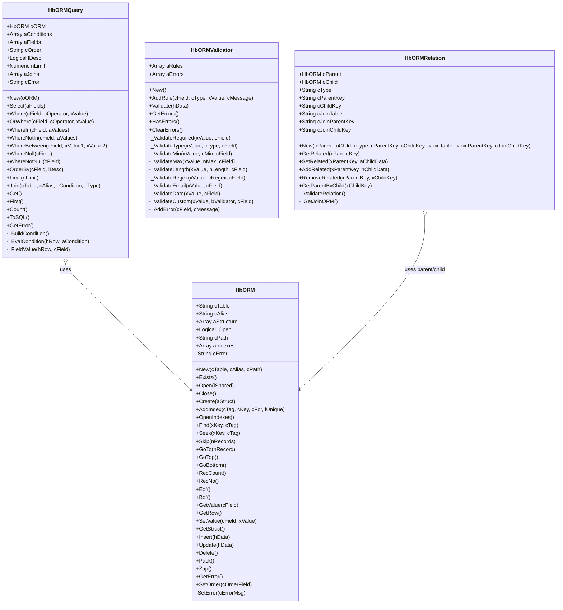
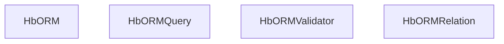

# HbORM Technical Manual 📖

This technical manual documents the development process of the **HbORM (Harbour Object-Relational Mapping)** library, a robust framework for managing DBF/CDX tables in Harbour. Designed for Harbour developers, HbORM provides an object-oriented interface for database operations, including table management, querying, data validation, and relationship handling. This manual details the system’s architecture, design decisions, implementation, and challenges, with UML diagrams in Mermaid format to illustrate its structure. 🚀

## Table of Contents 📋

1. [System Overview](#system-overview)
2. [Design Decisions](#design-decisions)
3. [Implementation Details](#implementation-details)
   - [HbORM Class](#hborm-class)
   - [HbORMQuery Class](#hbormquery-class)
   - [HbORMValidator Class](#hbormvalidator-class)
   - [HbORMRelation Class](#hbormrelation-class)
   - [Utility Functions](#utility-functions)
4. [Development Challenges](#development-challenges)
5. [UML Class Diagram](#uml-class-diagram)
6. [Inheritance Hierarchy](#inheritance-hierarchy)

---

## System Overview 📖

**HbORM** is a lightweight ORM library for Harbour, designed to simplify interactions with DBF/CDX tables, commonly used in legacy business applications. The system comprises four core classes and utility functions:

- **HbORM**: Manages DBF table operations (e.g., open, create, insert, update, delete).
- **HbORMQuery**: Provides a fluent interface for building complex queries with conditions, joins, and ordering.
- **HbORMValidator**: Ensures data integrity through customizable validation rules.
- **HbORMRelation**: Handles relationships (1:1, 1:N, N:M) between tables.
- **Utility Functions**: Support data conversion (`ArrayToList`, `ValToStr`).

The system aims to abstract low-level DBF operations, improve code maintainability, and enhance developer productivity while supporting Harbour’s native DBF/CDX environment. 📌

---

## Design Decisions 🛠️

The development of HbORM was guided by several key design principles:

1. **Modularity**: Each class (`HbORM`, `HbORMQuery`, `HbORMValidator`, `HbORMRelation`) is self-contained, promoting reusability and maintainability. This allows developers to use specific components (e.g., validation) independently.
2. **DBF/CDX Compatibility**: Methods are tailored to Harbour’s DBF/CDX specifics, such as record locking (`RLOCK`), index management (`DbCreateIndex`), and navigation (`DBSKIP`, `DBGOTOP`).
3. **Fluent Interface**: `HbORMQuery` adopts a chainable method design (e.g., `Where():Limit():Get()`) to simplify query construction, inspired by modern ORMs like Laravel’s Eloquent.
4. **Error Handling**: A consistent error management system (`SetError`, `GetError`) ensures robust debugging across all classes.
5. **Extensibility**: The system supports custom validations and complex relationships (N:M via join tables), making it adaptable to diverse use cases.

These decisions balance Harbour’s legacy constraints with modern programming paradigms, ensuring compatibility and flexibility. ✅

---

## Implementation Details 🔍

### HbORM Class

**Purpose**: The core class for managing DBF tables, providing methods for table creation, record manipulation, and index handling.

**Implementation**:
- **Constructor (`New`)**: Initializes table metadata (`cTable`, `cAlias`, `cPath`) and sets defaults for path handling using `CurDrive()` and `CurDir()`.
- **Table Operations**: Methods like `Open`, `Create`, and `Close` use Harbour’s `USE`, `DBCREATE`, and `USE` commands, with checks for file existence (`FILE`) and table state (`lOpen`).
- **Record Management**: `Insert`, `Update`, and `Delete` use record locking (`RLOCK`) to ensure data integrity, with `HEval` for efficient hash iteration.
- **Index Handling**: `AddIndex` and `OpenIndexes` manage CDX indexes, supporting unique indexes and conditional expressions (`cFor`).
- **Navigation**: Methods like `GoTop`, `Skip`, and `Find` leverage Harbour’s `DBGOTOP`, `DBSKIP`, and `DBSEEK` for record navigation.

**Example**:
```harbour
LOCAL oORM := HbORM():New("customers", "CUST", "C:\data\")
oORM:Open()
oORM:Insert({"ID" => 1001, "NAME" => "John Doe"})
oORM:Find(1001, "IDX_ID")
? oORM:GetValue("NAME")  // Outputs: John Doe
```

### HbORMQuery Class

**Purpose**: Builds complex queries with a fluent interface, supporting field selection, conditions, joins, and ordering.

**Implementation**:
- **Fluent Design**: Methods like `Where`, `Select`, and `Limit` return `Self` for chaining, storing conditions in `aConditions` and fields in `aFields`.
- **Query Execution**: `Get` iterates records, evaluates conditions using a dynamically built code block (`_BuildCondition`), and filters results with `HbORM_FilterFields`.
- **SQL Generation**: `ToSQL` constructs SQL strings for debugging, using `ArrayToList` and `ValToSQL` for formatting.
- **Condition Handling**: Supports multiple operators (`=`, `>`, `IN`, `BETWEEN`) and logical combinations (`AND`, `OR`) via `_EvalCondition`.

**Example**:
```harbour
LOCAL oQuery := HbORMQuery():New(HbORM():New("customers"))
oQuery:Select({"ID", "NAME"}):Where("AGE", ">", 25):Limit(5)
LOCAL aResults := oQuery:Get()
? ValToStr(aResults)  // Outputs: array of matching records
```

### HbORMValidator Class

**Purpose**: Validates data against customizable rules, ensuring data integrity before database operations.

**Implementation**:
- **Rule Storage**: Rules are stored in `aRules` as `{field, type, value, message}` arrays, supporting types like `required`, `email`, and `custom`.
- **Validation Logic**: `Validate` iterates rules, calling type-specific methods (e.g., `_ValidateEmail`, `_ValidateMin`) and collects errors in `aErrors`.
- **Extensibility**: Supports custom validation via code blocks (`_ValidateCustom`), enabling flexible business logic.
- **Error Management**: Methods like `GetErrors` and `ClearErrors` provide robust error handling.

**Example**:
```harbour
LOCAL oValidator := HbORMValidator():New()
oValidator:AddRule("EMAIL", "email", NIL, "Invalid email")
IF oValidator:Validate({"EMAIL" => "user@example.com"})
   ? "Valid data! ✅"
ELSE
   ? oValidator:GetErrors()
ENDIF
```

### HbORMRelation Class

**Purpose**: Manages relationships (1:1, 1:N, N:M) between tables, supporting operations like adding and retrieving related records.

**Implementation**:
- **Relationship Types**: Supports `1:1`, `1:N`, and `N:M` via `cType`, with `N:M` using a join table (`cJoinTable`).
- **Key Management**: Uses `cParentKey` and `cChildKey` for direct relationships, and `cJoinParentKey`/`cJoinChildKey` for N:M.
- **Operations**: `GetRelated` retrieves related records by iterating child or join tables, while `SetRelated` and `AddRelated` manage relationships with record locking.
- **Validation**: `_ValidateRelation` ensures configuration integrity (e.g., non-empty keys, valid types).

**Example**:
```harbour
LOCAL oParent := HbORM():New("customers")
LOCAL oChild := HbORM():New("orders")
LOCAL oRelation := HbORMRelation():New(oParent, oChild, "1:N", "CUST_ID", "CUST_ID")
oRelation:AddRelated(1001, {"ORDER_ID" => 1, "AMOUNT" => 100})
```

### Utility Functions

- **ArrayToList**: Converts arrays to delimited strings, with optional quoting using `ValToStr` for type-safe conversion.
- **ValToStr**: Handles various Harbour data types (e.g., numeric, date, logical) for consistent string representation.

**Example**:
```harbour
? ArrayToList({"apple", "banana"}, ",", .T.)  // Outputs: 'apple','banana'
? ValToStr(CTOD("2025-08-02"))  // Outputs: 2025-08-02
```

---

## Development Challenges 💡

1. **DBF/CDX Limitations**: Harbour’s DBF/CDX system lacks native SQL support, requiring manual iteration for queries (`HbORMQuery:Get`). This was addressed by building a flexible condition evaluation system (`_BuildCondition`).
2. **Record Locking**: Ensuring data integrity in multi-user environments required consistent use of `RLOCK` and `DBUNLOCK` across `Insert`, `Update`, and `Delete`.
3. **Relationship Complexity**: N:M relationships necessitated a join table approach, with `_GetJoinORM` to manage temporary ORM instances.
4. **Validation Flexibility**: Supporting diverse validation types (e.g., `regex`, `custom`) required a modular rule system and careful type checking (`_ValidateType`).
5. **Performance**: Iterating large DBF tables in `HbORMQuery` was optimized by limiting fields (`Select`) and records (`Limit`).

These challenges were mitigated through careful design, leveraging Harbour’s native commands and modular class structures. ✅

---

## UML Class Diagram 📊

The following Mermaid diagram illustrates the classes, their attributes, methods, and relationships in HbORM.



---

## Inheritance Hierarchy 📈

HbORM does not use inheritance, as each class is designed as a standalone component. The following diagram reflects this flat structure:



---

This manual provides a detailed view of HbORM’s development, from design to implementation, with clear diagrams and examples. For further details, contact marvijarrin@gmail.com. Happy coding! 🚀